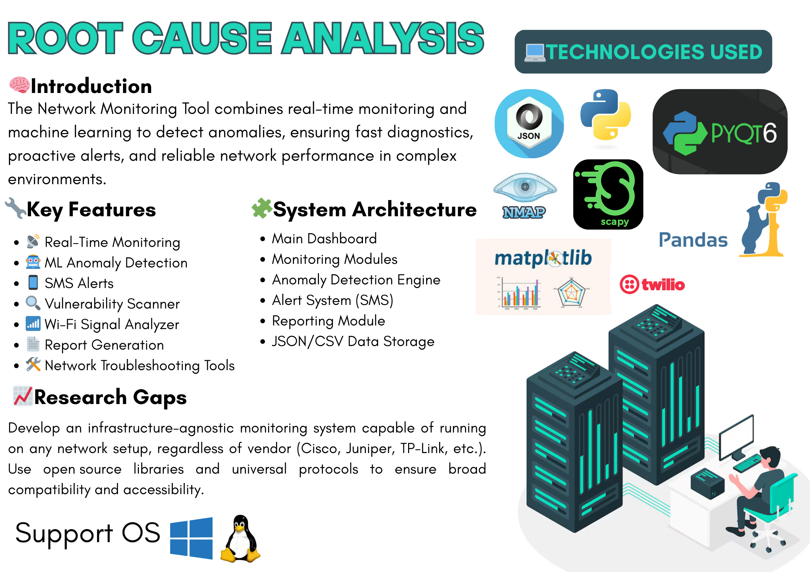

# Network Root Cause Analysis Tool

## Overview

This Network Root Cause Analysis Tool is a comprehensive suite designed for network administrators to monitor, analyze, and troubleshoot network issues. The application combines real-time packet analysis, anomaly detection, device scanning, and reporting capabilities in a unified interface.



## Demo Video

Watch a demonstration of the Network Root Cause Analysis Tool in action:

<video width="100%" controls autoplay>
  <source src="videos/demo.mp4" type="video/mp4">
  Your browser does not support the video tag.
</video>

[Direct video link](https://github.com/kosaladeshan/Final-Year-Project/raw/main/videos/demo.mp4)


## Features

- **Central Dashboard**: Unified control center for accessing all modules
- **Real-time Packet Analysis**: Capture and analyze network packets with filtering capabilities
- **Network Device Scanner**: Discover devices on your network and scan for vulnerabilities
- **WiFi Signal Analyzer**: Monitor and analyze wireless networks and signal strength
- **Anomaly Detection**: Machine learning-based system to identify unusual network behavior
- **SMS Alert System**: Receive notifications when network anomalies are detected
- **Reporting System**: Generate comprehensive PDF reports of network status and issues
- **Network Troubleshooting**: Tools to diagnose and resolve common network problems

## System Requirements

- Windows 10/11 (64-bit)
- Python 3.9 or higher
- Administrator privileges (required for packet capture)
- Minimum 4GB RAM
- 500MB free disk space

## Installation

### Step 1: Clone or Download the Repository

```
git clone https://github.com/yourusername/network-root-cause-analysis.git
cd network-root-cause-analysis
```

### Step 2: Create a Virtual Environment (Recommended)

```
python -m venv venv
venv\Scripts\activate
```

### Step 3: Install Required Dependencies

```
pip install -r requirements.txt
```

The `requirements.txt` file includes all necessary libraries like PyQt6, matplotlib, numpy, scapy, pandas, and more.

### Step 4: Optional - Install Twilio for SMS Alerts

If you want to use real SMS alerts (instead of simulated ones):

```
pip install twilio
```

## Configuration

### SMS Alert Configuration

1. Open `sms_alert_settings.json` in the root directory
2. Set `"enabled"` to `true` to enable SMS alerts
3. Update `"phone_number"` with your phone number in international format (e.g., "+1234567890")

Example configuration:
```json
{
    "enabled": true,
    "phone_number": "+1234567890",
    "alert_history": []
}
```

### Twilio Configuration (Optional)

If you want to use real SMS alerts with Twilio:

1. Sign up for a Twilio account at https://www.twilio.com
2. Get your Account SID and Auth Token from the Twilio dashboard
3. Create a file named `secret.py` in the SMS gateway directory with:

```python
account_sid = "your_account_sid"
auth_token = "your_auth_token"
twilio_number = "your_twilio_phone_number"
```

## Usage

### Running the Application

1. Ensure you're in the project directory
2. Run the main application with administrator privileges:

```
python Main.py
```

### Module Descriptions

- **Main Dashboard**: Central hub for accessing all tools
- **Network Monitoring**: Real-time tracking of network performance metrics
- **Network Troubleshooting**: Tools for diagnosing common network issues
- **Network Device Scanner**: Discovers devices and checks for vulnerabilities
- **WiFi Scanner**: Analyzes wireless networks and signal strength
- **Real-time Packet Filtering**: Captures and analyzes network packets
- **Report Generator**: Creates PDF reports of network status and issues

## Data Storage

The application stores temporary data in the `data_temp` directory, including:
- Packet analysis data
- WiFi scanning results
- Device scanning results
- Network monitoring data
- Troubleshooting history

## Troubleshooting

### Common Issues

1. **Permission Errors**: Run the application as Administrator
2. **Missing Modules**: Verify all dependencies are installed
3. **Packet Capture Issues**: Install WinPcap or Npcap on Windows
4. **SMS Alerts Not Working**: Check your SMS configuration

### Logs

Check the console output for error messages and debugging information.

## License

This project is licensed under the MIT License - see the LICENSE file for details.

## Acknowledgments

This project was developed as a university final year project, utilizing Python, PyQt6, and various open-source libraries.
